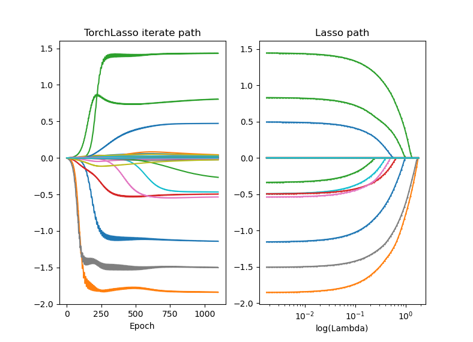

# regular-layers

**Note: this is work in progress**

## Background

We implement sparse linear layers for deep neural networks in **PyTorch**, as proposed in [1]. Something similar but for Tensorflow has been done in [2].

The main idea is the following: if you want a linear module, i.e. applying  `W@x+b`,  with weights `W` that are penalized with a l1-norm, this can be reformulated as `W = U*V` and penalizing `U` and `V` with a squared penalty (see [1] for details). Thus, the nonsmoothness from the l1-norm can be circumvented by doubling the number of parameters and using squared l2 penalty. The penalty term is given by

	l1 * ||W||_1 =  l1/2 * (||U||^2 + ||V||^2)

Using this module together with the `weight_decay` option in Pytorch optimizers (i.e. squared l2 penalty), you can obtain sparse layers.

## How to use

	from layers import L1Linear

The module `L1Linear` is a `torch.nn.Module` subclass and results in sparse weights. The module has parameters `self.weight_u` and `self.weight_v` for `U` and `V`.
The actual weights `W` (which are never explicitly optimized) can be retrieved by `self.get_weight()`. The regualarization parameter is given in the input `l1`.

## Examples

For illustrational purposes, you can use the `L1Linear` for solving Lasso problems in Pytorch. See `from lasso import TorchLasso`.

## References:

[1] Equivalences Between Sparse Models and Neural Networks, Ryan Tibshirani, 2021.

[2] [Deepregression package](https://github.com/neural-structured-additive-learning/deepregression/blob/main/inst/python/layers/lasso.py)
